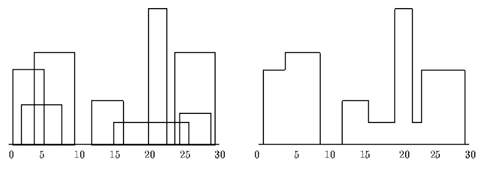

# skyline

> Divide and conquer algorithm to solve "[The Skyline Problem](http://www.algorithmist.com/index.php/UVa_105)".

[](http://lab.moogs.io/skyline)

# Demo

[http://lab.moogs.io/skyline](http://lab.moogs.io/skyline)

# Install

```bash
npm install skyline
```

# Usage

Input is a squence of building points: left x-coordinate, height y-coordinate, right x-coordinate.

Output is a sequence of skyline points: left x-coordinate, height y-coordinate;

```javascript
const skyline = require('flowright');

const buildings = [
  [1,11,5],
  [2,6,7],
  [3,13,9],
  [12,7,16],
  [14,3,25],
  [19,18,22],
  [23,13,29],
  [24,4,28]
];

var skylinePoints = skyline(buildings);
console.log(skylinePoints);
//
[
  [1,11],
  [3,13],
  [9,0],
  [12,7],
  [16,3],
  [19,18],
  [22,3],
  [23,13],
  [29,0]
]
```

# Test

```bash
npm test
```

# Credit

[This C solution](https://ideone.com/tP0aIo)

# License

MIT
